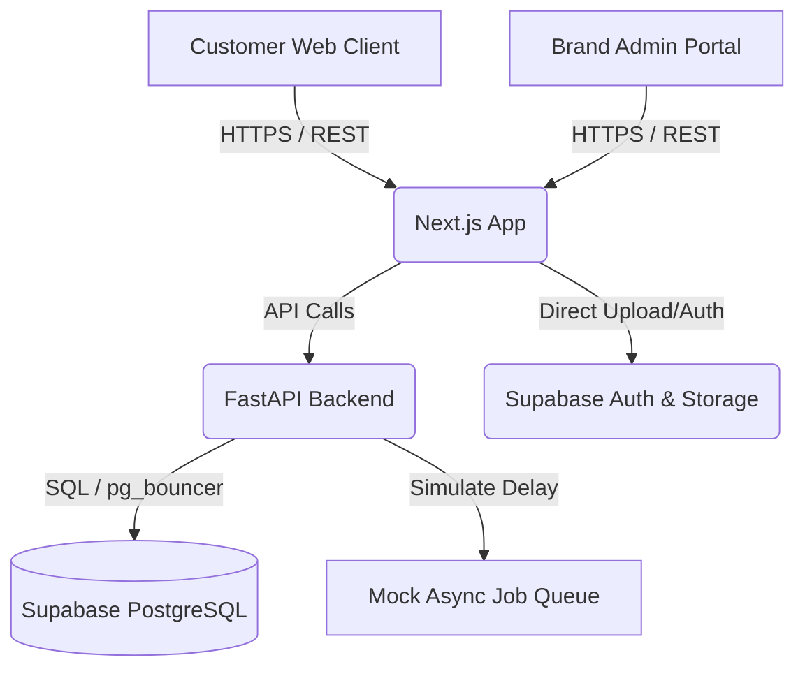
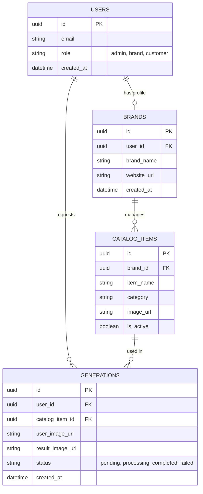

# Phase 3: System Architecture & ERD

> **CRITICAL RULE:** This document is the blueprint for the Engineering Team. It must be finalized before any coding begins. It MUST include concrete Mermaid diagrams, field data types, external integration points, and version control strategies.

---

## 1. Technology Stack & Implementation Details
- **Frontend:** Next.js 14 (App Router) + React 18 + Tailwind CSS. Hosted on Vercel.
- **Backend:** FastAPI (Python 3.11). Hosted on Render / AWS ECS.
- **Database:** PostgreSQL (managed by Supabase) for relational data and Auth.
- **Storage:** Supabase Storage (S3-compatible) for image uploads.
- **Queue/Async:** Redis (Upstash) for simulating async generation jobs (and future AI worker integration).

## 2. System Architecture Diagram

## 3. Database Entity Relationship Diagram (ERD)

## 4. Core Tables Data Types
- **`users`**: Managed by Supabase Auth (`auth.users`).
- **`brands`**: `id` (UUID PK), `user_id` (UUID FK to `auth.users`), `brand_name` (VARCHAR 255), `website_url` (TEXT), `created_at` (TIMESTAMPZ).
- **`catalog_items`**: `id` (UUID PK), `brand_id` (UUID FK), `item_name` (VARCHAR 255), `category` (VARCHAR 100), `image_url` (TEXT), `is_active` (BOOLEAN DEFAULT TRUE).
- **`generations`**: `id` (UUID PK), `user_id` (UUID FK), `catalog_item_id` (UUID FK), `user_image_url` (TEXT), `result_image_url` (TEXT), `status` (VARCHAR 50), `created_at` (TIMESTAMPZ).

## 5. API Core Endpoints & Integrations
| Method | Endpoint | Description | Auth Required? |
|--------|----------|-------------|----------------|
| POST   | `/api/v1/catalog` | Add new item to catalog | Yes (Brand) |
| GET    | `/api/v1/catalog/{brand_id}` | List catalog items | No |
| POST   | `/api/v1/generate/request` | Submit try-on request | Yes (Customer) |
| GET    | `/api/v1/generate/status/{id}` | Poll generation status | Yes |

## 6. Integration Points & External APIs
- **Supabase API:** Authentication, PostgreSQL, Storage.
- **Future Integration (Plan 2):** Stripe API for brand subscriptions.

## 7. Scalability, Performance & Version Control
- **Version Control & CI/CD:** Git flow. `main` branch deployed to production automatically via Vercel GitHub integration. FastAPI deployed via Docker/Render.
- **Scalability Considerations:** Next.js handles high traffic via Edge caching. FastAPI scales horizontally. Supabase scales via connection pooling (pg_bouncer).

## 8. Detailed Security Mechanisms
- **SQL Injection Prevention:** Strict usage of SQLAlchemy ORM and Supabase Row Level Security (RLS) policies.
- **Data Protection:** Enforced TLS 1.3. User photos stored in secured Supabase buckets with strict CORS and access policies.
- **Authentication:** Supabase JWT tokens. Backend API verifies JWT signature before executing any catalog or generation mutations.

---
**Sign-off:**
- [x] Solution Architect (Antigravity)
- [x] Lead Developer
- [x] Client Approval
